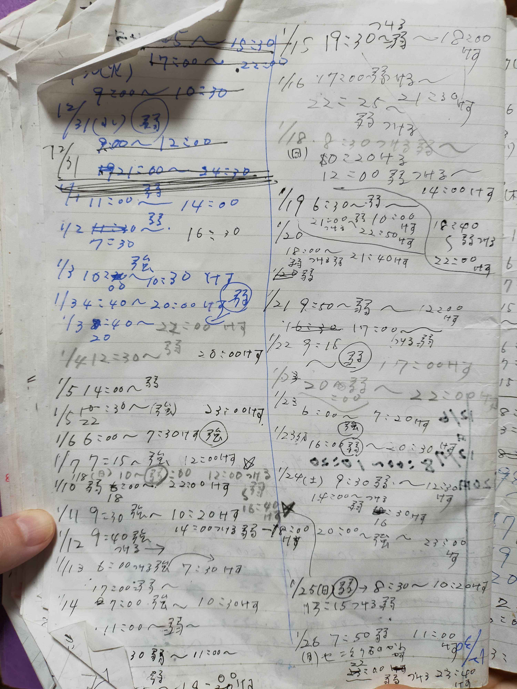
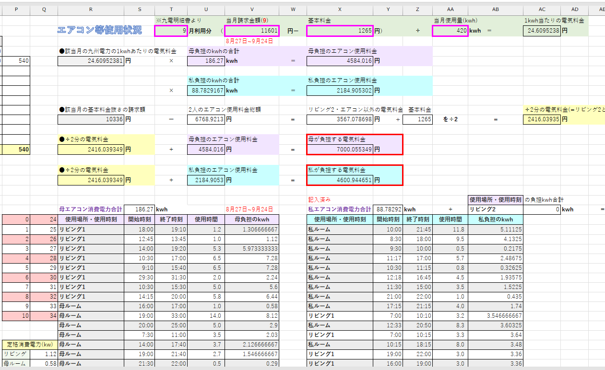
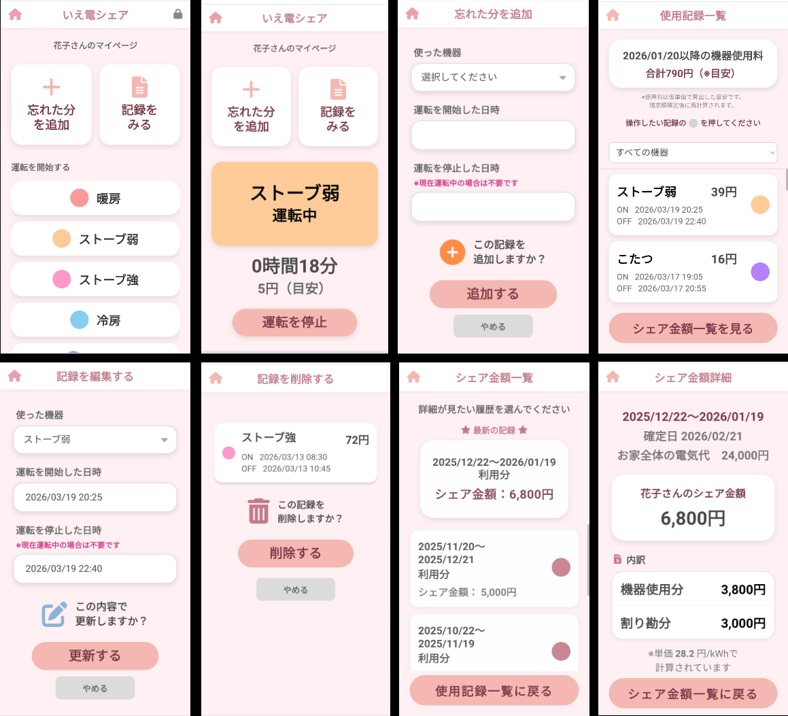
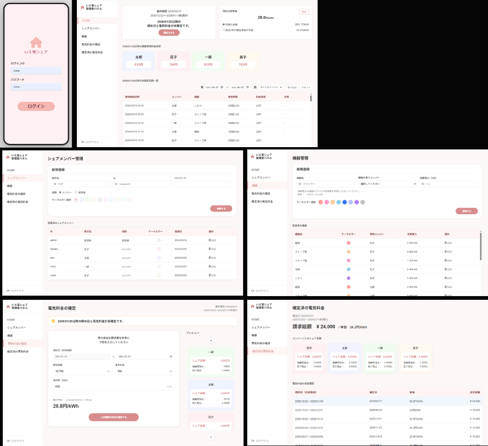
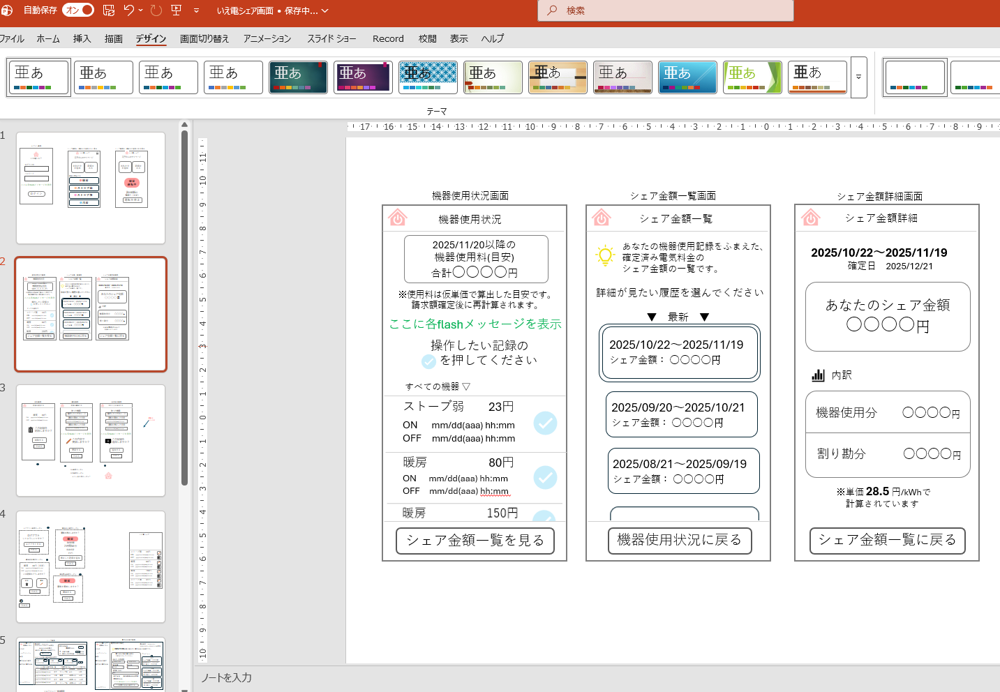
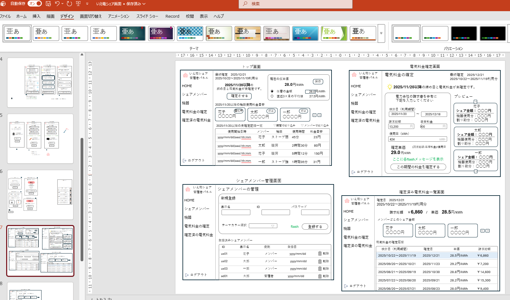
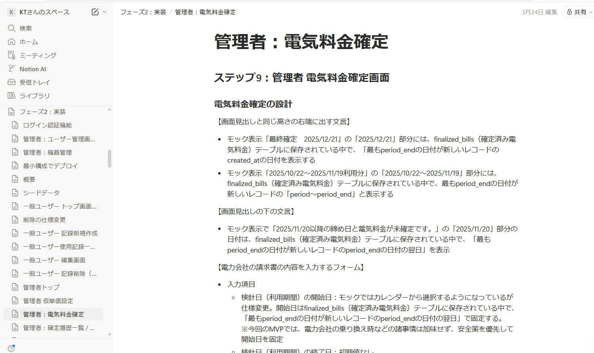
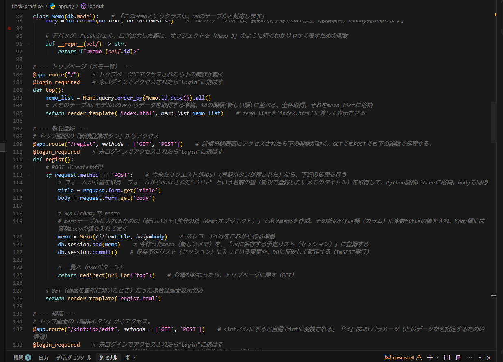
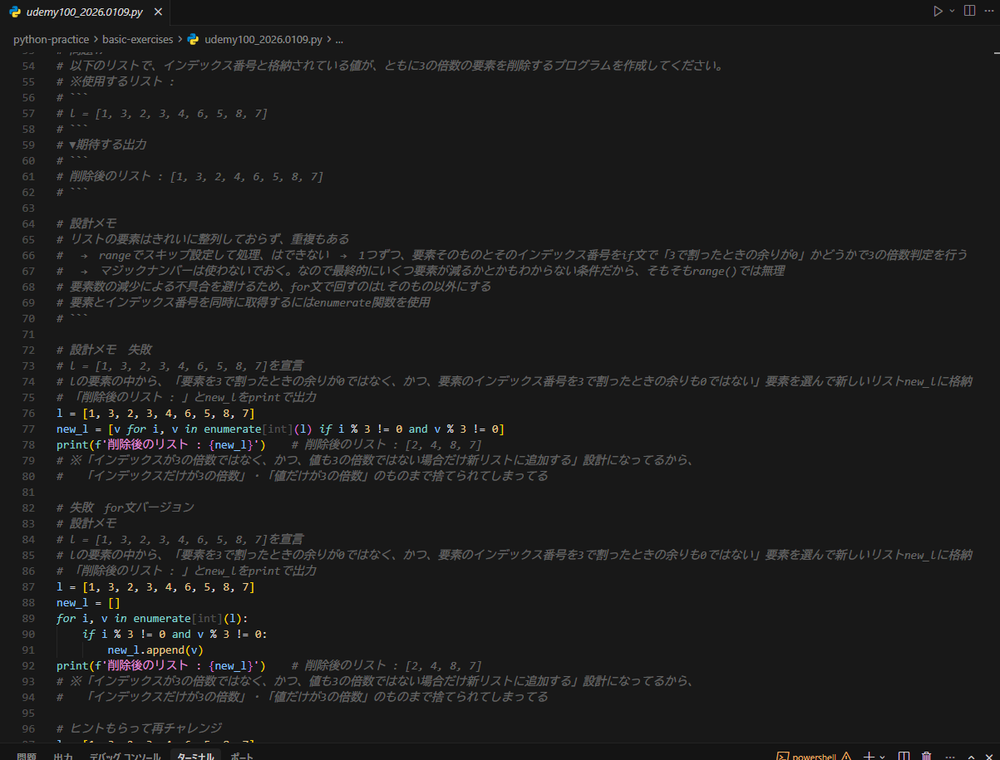

# いえ電シェア（family-electricity-cost-share）

---

## 📑 目次

- [デプロイ先URL](#-デプロイ先url)
- [アプリケーション概要](#-アプリケーション概要)
- [製作背景](#-製作背景)
- [利用イメージ](#-利用イメージ)
- [機能](#-機能)
- [工夫した点](#-工夫した点)
- [使用技術スタック](#-使用技術スタック)
- [画面一覧](#-画面一覧)
- [ER図](#-er図)
- [生成AIの活用方針](#-生成aiの活用方針)

---

## 💡 デプロイ先URL
https://ie-den-share.onrender.com/

※ Renderの無料プランでは不安定だったため、3/28に有料プランへ移行しました。

※ ポートフォリオ確認用のシードデータを投入しています。  
以下のテスト用アカウントでログインし、各機能を自由にお試しいただけますと幸いです。

### ■ 管理者  

ログインID：admin  
パスワード：admin123

### ■ 一般ユーザー  

パスワード：test123  

- hanako
- taro
- ichiro
- ryoko

一般ユーザーのパスワードはすべて共通です

---

## 💡 アプリケーション概要
家庭内で使用した電気機器（特に消費電力量の多いエアコン・ストーブ等）の利用時間を記録し、電気料金を公平にシェアするためのWebアプリケーションです。

- 誰が
- どの機器を
- どれくらい使用したか

を記録し、電力会社の請求額をもとに各シェアメンバーの負担金額（シェア金額）を自動計算します。

---

## 💡 製作背景

### ■ なぜこのアプリを作ったのか

我が家は、私（在宅勤務）と高校生の娘・パート勤務の母の2世帯同居で生活しています。  
食費や家賃、ネット代などは「私世帯2人分・母世帯1人分」でなるべく公平に分担しています。

しかし、電気料金だけは単純に人数で割ると不公平が生じていました。

- そもそもエアコンがない部屋で扇風機とコタツのみ使用する娘  
- エアコンやストーブを頻繁に使用する母  
- 節約志向で極力エアコンを使わない私  

当然ながら、ただの割り算では納得感がなく・・・  

「またつけっぱなしだったでしょ」  
「だって暑いんだもん」  

といった小さな衝突が日常的に発生していました。

---

### ■ これまでの運用（アナログ運用）

そこで約2年前から、

- 各自が冷暖房機器の「運転開始・停止時刻」を手書きで記録  
- 月に1度、電力会社の請求書をもとに  
- 書きためた記録をExcelシートへ転記し、消費電力量と使用時間から負担額を算出  

という運用を始めました。

その結果、電気料金の分担に対する納得感が生まれ、家族間のトラブルは大きく減少しました。

---

### ■ しかし新たな課題が発生

一方で、この運用には大きな負担がありました。

- 私  
  → Excelに直接入力できるが、起動が面倒で結局メモを併用  

- 母  
  → すべて手書きで記録  
  → 使用頻度が高く記録数も多いため負担が大きい  
  → 自分で書いた文字が雑すぎて読めない・日時ミス・終了時刻の書き忘れが頻発  

- 月1回の集計作業  
  → 母がノートを読み上げ、私がExcelに入力  
  → まるでそろばんの読み上げ算のような、集中力を要する作業  
  → エアコンの稼働率が上がる時期には記録が50件以上になることもあるため、まとまった時間を要する  

---

### ■ このアプリで解決したいこと

こうした課題を解決するために、本アプリを開発しました。

- ワンタップで記録できる仕組みによる負担軽減  
- リアルタイム記録による記録漏れの防止  
- 自動計算による集計作業の削減  
- 各自の使用量に応じた「納得感のある電気料金分担」の実現  

「ポートフォリオ用に何か制作するなら、テーマは絶対これにする！」  
プログラミング学習をはじめた当初からずっと心に決めていた、実体験ベースの本気の課題解決アプリとなっています。  
実運用が非常に楽しみです。

---

※ 実際に使用している母の手書きノートとExcelシート  

  

---

## 💡 利用イメージ

日々の使用記録は各メンバーが行い、電気料金の確定は家族代表（管理者）がまとめて行います。

---

### ■ 一般ユーザー（シェアメンバー）の使い方

1. ログイン後、自分のトップ画面から使用する機器を選び、運転を開始します。  
2. 使用が終わったら、同じ画面から運転を停止します。  
3. リアルタイムで記録できなかった場合は、「忘れた分を追加」から開始日時・停止日時を入力して記録できます。  
4. 使用記録一覧で、自分がどの機器をどれだけ使ったかを確認できます。（「仮単価」で計算した使用料の目安も含む）  
5. 記録ミスがあった場合は、未確定期間の記録のみ編集・削除できます。  
6. 電気料金が家族代表によって確定されると、シェア金額一覧で自分の負担額を確認できます。  
7. 詳細画面では、シェア金額の内訳（機器使用分・割り勘分）まで確認できます。  

---

### ■ 管理者（家族代表）の使い方

1. まず、シェアメンバーと各メンバーが使用する機器を登録します。  
2. 日々の記録中は、「仮単価」を設定しておくことで、各メンバーが使用料金の目安を確認できます。  
3. 電力会社から請求額が届いたら、対象期間・請求総額・基本料金・使用量を入力し、電気料金を確定します。  
4. 確定時には、「確定単価」・各メンバーの機器使用分・割り勘分をもとに、シェア金額が自動計算されます。  
5. 確定後は、確定済み電気料金一覧から過去の確定内容を確認できます。  

---

### ■ 想定している利用シーン

- 家族それぞれがエアコンやストーブなどの使用時間を日常的に記録する  
- 電力会社からの請求書到着後に、家族代表が電気料金を確定する  
- 各メンバーが「自分はいくら負担するのか」を後から確認する  

このように、日々の使用記録から月ごとの負担額確認までを、家庭内でわかりやすく一元管理できるアプリです。

---

## 💡 機能

### ■ 今回のMVPで実装済みの機能

【管理者】

- シェアメンバー管理
- 機器管理
- 仮単価設定
- 電気料金確定
- 確定履歴の確認

【一般ユーザー】

- 機器の運転開始 / 停止
- 使用記録の追加 / 編集 / 削除
- 使用記録一覧の確認
- シェア金額の確認 / 内訳表示

【電気料金計算ロジック】

- 機器使用分  
機器消費電力 × 使用時間 × 単価
- 割り勘分  
(請求総額 − 機器使用料金合計) ÷ シェアメンバー人数
- シェア金額  
機器使用分 + 割り勘分

---

### ■ MVPで見送った機能と今後の拡張予定

#### 【一般ユーザー】

- 消し忘れ注意・シェア金額確定などの通知機能  
  → MVP段階では、基本機能である記録と金額確認の体験に集中するため未実装  
  → 将来的には、記録漏れ防止や利便性向上のため通知機能の追加を検討  

- ダークモード切り替え  
  → コア機能に直接影響しないため優先度を下げて見送り  
  → 将来的には、ユーザーの利用環境に応じたUIカスタマイズとして対応予定  

- リアルタイムでの複数機器の同時運転への対応  
  → 記録処理をシンプルに保つため、MVPでは単一機器の運転のみ対応  
  → 将来的には、複数機器の同時運転や時間帯の重複をリアルタイムで扱えるよう拡張予定  

#### 【管理者】

- ユーザー・機器の削除制御  
  → 料金計算の根拠となる関連履歴が存在する場合、データ整合性を優先し物理削除を禁止  
  → そのため、UI上は削除操作が可能な状態のままとしている  
  → 将来的には、論理削除の導入による柔軟なデータ管理への改善を検討  

- 削除済み記録の復旧機能  
  → MVP段階では、削除操作のシンプルさを優先し未実装  
  → 将来的には、誤操作への対応として復旧機能の追加を検討  

- 割り勘対象メンバーの選択機能  
  → MVPでは計算ロジックをシンプルに保つため、全員を対象とする仕様とした  
  → 将来的には、利用状況に応じて対象メンバーを選択できるよう拡張予定  

- 詳細な分析機能（グラフ表示など）  
  → MVPでは「記録」と「料金確定」にフォーカスするため対象外とした  
  → 将来的には、使用傾向の可視化や節電意識向上のための機能として追加予定  

このように、段階的な機能拡張を前提とした設計としています。

---

## 💡 工夫した点

### ■ 誤操作を防ぐUI設計

年配の家族が日常的に使用することを想定しているため、一般ユーザー側のUIは誤操作を防ぐことを重視した設計にしています。

- 全体的になるべく文字サイズを大きめにする
- 重要な操作（追加・更新・削除）には確認モーダルを表示  
- 一覧表示では、カード全体ではなくアイコンタップで操作対象を選択  
- 操作が明確になるよう、あえてメニューバーなどは設置せず、ボタン配置や導線をシンプルに設計  
 
---

### ■ ロールごとの役割を明確にした設計

一般ユーザーと管理者（家族代表）の役割を明確に分離しています。

- 一般ユーザー：使用記録の登録・確認に専念  
- 管理者：メンバー管理・機器管理・電気料金の確定処理に専念  

したがって、管理者には一般ユーザーの記録を直接編集・削除する機能をあえて持たせていません。  
また、将来的には、一般ユーザーが誤って削除した記録を復旧できる機能の追加を検討しています。

---

### ■ GitHub Flowを意識した開発プロセス

個人開発ではありますが、実務を意識しGitHub Flowに近い形で開発を進めました。  

- mainブランチに直接コミットせず、機能ごとにブランチを作成  
- 実装単位でコミットを分割し、変更内容が追いやすいように管理  
- 作業完了後にPull Requestを作成し、差分を確認してからマージ  
- コミットメッセージは内容が分かる粒度で記述（例：feat:, fix:, docs: など）

簡略化した運用ではありますが、今後の実務を見据えた開発フローを意識しています。

---

### ■ シンプルな構成による開発スピードの最適化

本アプリでは、MVPとして短期間での完成を優先し、構成をできるだけシンプルに保っています。  

- ルート定義は分割せず、app.py に集約  
- テンプレートは base.html による共通化を行わず、各画面に直接記述  

本来は、機能ごとのルーティング分割や、共通レイアウトの切り出しによるテンプレート継承を用いることで、保守性や再利用性を高める構成が望ましいと考えています。  

一方で今回は、実装・修正・動作確認を素早く回せることを優先し、あえてシンプルな構成を採用しました。  
今後の改善として、ルート定義の整理や共通レイアウトの切り出しによる保守性向上を検討しています。

---

### ■ 日時の一貫性を保つための設計

本アプリでは、記録の正確性を保つために、日時の取り扱いを統一した設計としています。

- 保存時は UTC（協定世界時）で統一し、DBにはタイムゾーン付き日時（`db.DateTime(timezone=True)`）として保存  
- 表示時は、日本時間（Asia/Tokyo）へ変換してからユーザーに表示  
- 「保存はUTC、表示は日本時間」という役割分担で一貫性を確保  

この設計とした理由は、デプロイ環境に依存した時刻ズレを防ぐためです。  
本アプリは Renderおよび Neonを使用しており、いずれも海外リージョン（シンガポール）上で稼働しています。

そのため、サーバーのローカル時刻や実行環境に依存した実装にすると、日本時間とのズレ（例：1時間差）や、環境変更時の不整合が発生する可能性があります。  

これを防ぐため、DB上では世界共通の基準であるUTCで時刻を統一し、比較・集計処理もすべてUTCで行う設計としています。  
そのうえで、ユーザーに表示する際のみ日本時間へ変換することで、正確性と分かりやすさを両立しています。

---

## 💡 使用技術スタック

### ■ バックエンド
- Python  
- Flask
- SQLAlchemy
- Flask-Migrate
- Flask-Login
- Flask-WTF
- python-dotenv

### ■ データベース
- PostgreSQL（Neon）
- psycopg2

### ■ フロントエンド
- HTML / CSS / JavaScript
- Jinja2

### ■ インフラ・デプロイ
- Render
- Gunicorn

### ■ その他
- 一部機能で非同期通信（簡易API的な処理）を使用

---

### 💡 技術選定理由

- Python  
  → 実務での使用技術を意識しつつ、学習コストが低く短期間での開発に適しているため

- Flask  
  → 学習コストが低く、MVP開発に適しているため

- SQLAlchemy  
  → 新たにSQL言語を学習する必要がなく、DB操作をPythonで安全に扱えるため

- PostgreSQL（Neon）  
  → 本番運用に耐えうる構成にするため

- Render  
  → 簡単にデプロイでき、ポートフォリオ公開に適しているため

---

## 💡 画面一覧
※ 2026/03/28時点　今後も少しずつ改善予定です。

### ■ 一般ユーザー　
※ スマホでの使用を想定（PCからのアクセスでもスマホ画面を模した表示にしています）  
※ ログイン画面のみ管理者と共通です

### ■ 管理者　
※ PCでの使用を想定

---

## 💡 ER図

---

## 💡 生成AIの活用方針

### ■ 基本方針

生成AI（ChatGPT / Codex / Geminiなど）を「実装補助ツール」として活用し、設計・仕様決定・最終判断はすべて自身で行う方針で開発しました。

---

### ■ 開発スタイル

本アプリは、以下のような流れで開発しています。

- 自分 ： 一般ユーザーと管理者それぞれの課題を洗い出し、それを元に要件をまとめる 
- 自分 ： 実際の操作を想像しながらPowerPointでラフを描いて画面設計  
- 自分 ： 画面設計を元にテーブル設計を行う  
- AI・自分 ： ChatGPTとディスカッションしながらテーブル設計を修正およびアップデート  
- AI・自分 ： PowerPointで書いた画面のラフと設計を細かく指示してGeminiでモック作成  
- AI・自分 ： ChatGPTの支援 + 技術系記事を参考にハルシネーション対策しながら環境構築  
- AI・自分 ： 設計をもとにCodexにプロンプトを渡して各画面の実装（※ 実装の詳細は後ほど）  
- AI・自分 ： 完成後、全体のリファクタリング・UI調整  

「AIに作らせる」というより、「AIと一緒に開発する」感覚に近いです。

---

### ■ 詳細な実装プロセス

1画面ごとに、主に以下のサイクルで開発しました。 ※ サイクル自体は3画面作った辺りで確立

1. 自分 ： モックをもとに更に詳細な設計・業務ルールを整理した文書を作成  
2. AI・自分 ： 文書をChatGPTに共有し、設計の抜け漏れや実装方針を確認  
3. AI ： 決定した設計および実装方針をもとにChatGPTがCodex用のプロンプトを生成  
4. 自分： 生成されたプロンプト内容を確認・修正  
5. AI ： Cursorに拡張機能として導入したCodexにプロンプトを渡し、1画面を平均4〜5ステップに分割して段階的に実装  
   
そして下記を、1ステップ実装するごとに繰り返します。

- AI・自分 ： ChatGPTに差分を共有し、解説を受けながら自分も何をしているコードなのかを確認  
- AI ： ChatGPTがテスト項目を作成  
- 自分 ： 手動テストを行い、問題なければコミット  

※ 画面設計・1画面ごとに作成した文書

---

### ■ 工夫した点

- 実装前に必ず設計を定義してプロンプトに盛り込み、勝手な裁量を入れさせないようにする  
- DEVELOPMENT_RULES.mdを設置し、タスク実行前に毎回確認させる
- 生成されたプロンプトはそのまま使わず、自分の意図に合わせて調整する  
- 生成されたコードは差分を見て、意図に沿わない処理が含まれていないか確認した上で採用  
- 一度に大きく実装せず、小さな単位でテストを繰り返す  

---

### ■ 学習・理解について

ポートフォリオ制作に入る前の学習フェーズでは、AIは家庭教師役としての役割に留め、下記のような取り組みを日々行っていました。  

- ChatGPTのコード解説を自分の言葉に直して1行ずつapp.pyに書き込む  
- コーディング問題集では、先に日本語で詳細な疑似コードを書いた後でPythonコードに落とし込む  

※ app.pyと問題集：-learning-notes リポジトリより

そして今回のポートフォリオにおいては、制作期間が約25日と短かったこともあり、正直に申し上げますとすべてのコードを十分に理解しきれている状態ではありません。

実装中は時間的な制約もあり、「差分を確認して何をしているコードかを追う」ことを中心に進めており、学習フェーズのような事細かな言語化や深掘り理解までは十分に行えていません。  
設計に多くの時間を当て、短期間での実装を優先した分、提出後にしっかり理解を回収していく前提で開発を進めました。

そのため現在は、制作中に生じた理解不足を解消するために、実装した機能を改めて一つずつ追い直す形で理解の補完に取り組んでいます。

---

### ■ 使用したAIツールと役割

- ChatGPT  
  → 設計レビュー、プロンプト作成、テスト観点の整理  
  → 学習フェーズにおいては家庭教師役

- Codex（Cursor拡張機能）  
  → 実装支援  

- Gemini  
  → 画面モック（HTML）生成  

- Cursor  
  → Cursor Browserのビジュアルエディタで直感的にUI調整
  
---

### ■ まとめ

AIに任せきりにするのではなく、「設計と手動テストは自分、実装は協力して進める」というスタンスで開発を行いました。だまだ学習途中ではありますが、「実装 → 理解 → 改善」のサイクルを回し続けられる状態を目指しています。
